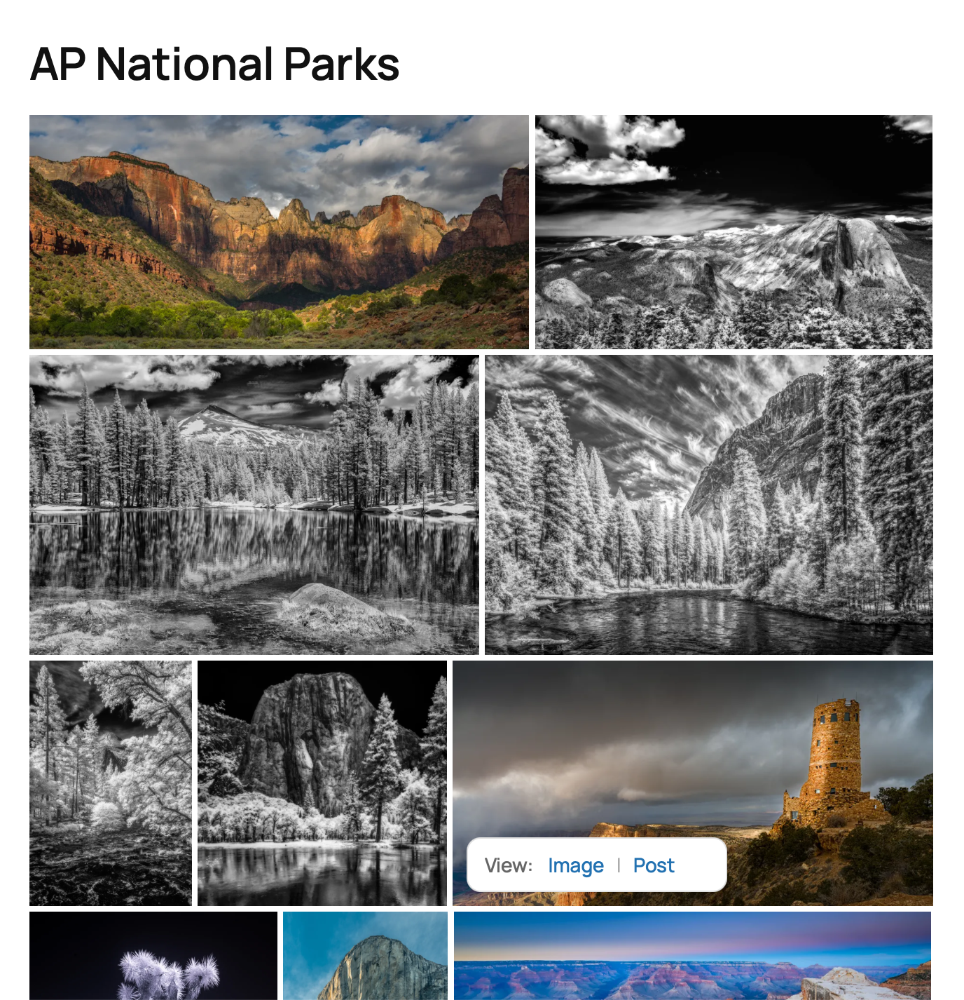
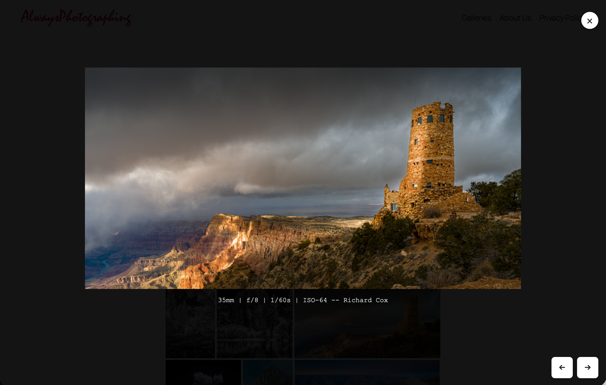

# Category Image Gallery

**Category Image Gallery** is a lightweight, flexible WordPress plugin for displaying image galleries automatically generated from post categories.  
It supports multiple layout styles (tiled, collage, grid, masonry), randomization, optional inclusion of draft posts, and dynamic image linking behavior that respects publication state and user login status.

---

## ✨ Features

- 📂 **Category-based galleries** — Automatically pulls featured images or attachments from posts in a chosen category.  
- 🧩 **Multiple layouts** —  
  - `tiled` (Jetpack-style justified rows)  
  - `collage` (metro-style mosaic)  
  - `grid` and `masonry` (optional)  
- 🔁 **Randomized selection** when there are more images than the specified max.  
- 🕐 **Cycle interval** options (`daily`, `hourly`, etc.) to refresh randomized images.  
- 🧱 **Custom row heights, gutter spacing, panorama detection**, and intelligent last-row balancing for the `tiled` layout.  
- 🧑‍💻 **Draft-aware rendering** —  
  - Published posts → image links to post.  
  - Draft/private posts (visitor) → image shown, **no link**.  
  - Draft/private posts (logged-in user) → image links to post.  
- 🖼️ **Click-menu option** to choose between viewing the image or reading its post.
- 🔍 **Built-in lightbox** — All thumbnail clicks open images in an elegant, keyboard-navigable lightbox that keeps users on your page.
- 📊 **EXIF metadata display** — Show camera settings, copyright, and other metadata using customizable templates.
- 🏗️ **Enhanced category hierarchy** — Automatically includes all children and grandchildren categories.
- ⚡ **Responsive, lazy-loaded**, and **SEO-friendly** images.  
- 🔒 Works with both published and unpublished (private) content when desired.

---

## 🧠 Usage

Insert the shortcode in any post, page, or block:

```text
[category_image_gallery
  category_slug="infrared-photography"
  layout="tiled"
  row_height="230"
  tolerance="0.3"
  panorama_thresh="2.6"
  min_per_row="2"
  max_per_row="6"
  last_row="left"
  gutter="4"
  max="20"
  include_draft="true"
  click_menu="true"
  link_thumbnail_to="image"
  display_meta="{Camera} • {Lens} • f/{FNumber} • {ShutterSpeed}s • ISO {ISO}"]
```

### Key Shortcode Attributes

| Attribute | Description |
|------------|--------------|
| `category_slug` | Slug of the category to pull images from. |
| `layout` | `tiled`, `collage`, `grid`, or `masonry`. |
| `row_height` | Base height (px) for tiled rows. |
| `tolerance` | Flex factor (0–0.6). Larger = smoother row balancing. |
| `panorama_thresh` | Aspect ratio (e.g. 2.6) at which an image fills a full row. |
| `min_per_row`, `max_per_row` | Soft bounds on images per row. |
| `last_row` | `left` (not stretched) or `justify`. |
| `gutter` | Horizontal gap between images (px). |
| `v_gutter` | Optional vertical gap (defaults to same as `gutter`). |
| `max` | Maximum number of images to show. |
| `include_draft` | Include unpublished posts. Non-logged-in visitors see image only; logged-in users can click to the post. |
| `click_menu` | Adds a small dropdown menu when hovering over images with "Image" and "Post" options. |
| `link_thumbnail_to` | `image` (opens lightbox) or `post` (links to post). Default: `post`. |
| `display_meta` | EXIF metadata template (e.g., `"{Camera} • f/{FNumber} • ISO {ISO}"`) shown as image captions in lightbox. |
| `cycle` | `hourly`, `daily`, or blank — randomize refresh frequency. |

---

## 🔍 Lightbox & Metadata Features

### Built-in Lightbox
All thumbnail interactions open images in a beautiful, full-screen lightbox that:
- **Never redirects** users away from your page
- Supports **keyboard navigation** (arrow keys, escape)
- Shows **EXIF metadata** as captions when configured
- Includes **previous/next navigation** for gallery browsing
- Works seamlessly with the **click menu** system

### EXIF Metadata Display
Use the `display_meta` attribute to show camera information and other metadata:

```text
display_meta="{Camera} • {Lens} • f/{FNumber} • {ShutterSpeed}s • ISO {ISO}"
```

**Available metadata tokens:**
- `{Camera}` — Camera make and model
- `{Lens}` — Lens information  
- `{FNumber}` — Aperture (f-stop)
- `{ShutterSpeed}` — Shutter speed
- `{ISO}` — ISO sensitivity
- `{FocalLength}` — Focal length
- `{Copyright}` — Copyright information
- `{FileName}` — Original filename

### Category Hierarchy
The plugin now automatically includes images from **all descendant categories** (children, grandchildren, etc.) when you specify a parent category, giving you comprehensive category-based galleries.

---

## 📸 Screenshots

### Tiled Gallery View

*Example of the tiled layout showing a responsive, justified grid of images from the "us-national-parks" category*

### Lightbox (Lighttable) View

*Built-in lightbox displaying full-size images with EXIF metadata, navigation controls, and keyboard support*

---

## 🧱 Layout Examples

```text
[category_image_gallery category_slug="us-national-parks" layout="tiled" row_height="230" tolerance="0.30" panorama_thresh="2.6" min_per_row="1" max_per_row="3" last_row="left" gutter="4" v_gutter="4" include_draft="true" click_menu="true" display_meta="{FocalLength} | {FNumber} | {ShutterSpeedValue} | {ISOSpeedRatings} -- {Copyright,Richard Cox}"]
```
**Tiled (Jetpack-style justified layout)**  
Balances rows automatically based on image aspect ratios.

**Collage (Metro layout)**  
Images span variable columns and rows; excellent for IR or travel galleries.

---

## 🔐 Draft and Login Logic

| Post Status | Logged-In User | Behavior |
|--------------|----------------|----------|
| Published | Any | Thumbnail opens lightbox; click menu shows "Image" (lightbox) and "Post" (link) options |
| Draft / Private | ✅ | Same as published |
| Draft / Private | 🚫 | Thumbnail opens lightbox; click menu shows "Image" (lightbox) only |

**Security Note:** Direct image URLs are never exposed in the browser address bar or accessible via right-click. All image viewing happens through the secure lightbox system.

---

## 🧰 Installation

1. Copy the plugin folder into `/wp-content/plugins/category-image-gallery/`.  
2. Activate **Category Image Gallery** from your WordPress admin → *Plugins*.  
3. Use the shortcode in any post, page, or block.

---

## ⚙️ Developer Notes

- Images are fetched via `WP_Query` based on the category and all its descendants (children, grandchildren, etc.).  
- When `include_draft="true"`, attachments from unpublished posts are included in the gallery.  
- Visibility and linking behavior are determined at render time based on `get_post_status()` and `is_user_logged_in()`.  
- The JavaScript portion performs live layout adjustments for justified (tiled) and collage modes, plus handles the lightbox functionality.
- Built-in lightbox system prevents direct image URL exposure and keeps users engaged on your site.
- EXIF metadata extraction supports various camera data points with customizable display templates.
- CSS variables (`--ap-gap`, `--ap-vgap`, `--ap-cols`, etc.) make the layout theme-friendly and easily overridable.

---

## 🧩 Example Gallery (US National Parks)
```text
[category_image_gallery 
  category_slug="us-national-parks" 
  layout="tiled" 
  row_height="230" 
  tolerance="0.30" 
  panorama_thresh="2.6" 
  min_per_row="1" 
  max_per_row="3" 
  last_row="left" 
  gutter="4" 
  v_gutter="4" 
  include_draft="true" 
  click_menu="true" 
  display_meta="{FocalLength} | {FNumber} | {ShutterSpeedValue} | {ISOSpeedRatings} -- {Copyright,Richard Cox}"]
```

## 🧩 Photography Portfolio Example
```text
[category_image_gallery
  category_slug="portfolio"
  layout="collage"
  cols="6"
  max="24"
  click_menu="true"
  display_meta="{Camera} • f/{FNumber} • ISO {ISO} • {Copyright,© AlwaysPhotographing}"]
```

---

## 🪪 License

This project is licensed under the **MIT License**:

```
MIT License

Copyright (c) 2025 Richard Cox

Permission is hereby granted, free of charge, to any person obtaining a copy
of this software and associated documentation files (the "Software"), to deal
in the Software without restriction, including without limitation the rights
to use, copy, modify, merge, publish, distribute, sublicense, and/or sell
copies of the Software, and to permit persons to whom the Software is
furnished to do so, subject to the following conditions:

The above copyright notice and this permission notice shall be included in
all copies or substantial portions of the Software.

THE SOFTWARE IS PROVIDED "AS IS", WITHOUT WARRANTY OF ANY KIND, EXPRESS OR
IMPLIED, INCLUDING BUT NOT LIMITED TO THE WARRANTIES OF MERCHANTABILITY,
FITNESS FOR A PARTICULAR PURPOSE AND NONINFRINGEMENT. IN NO EVENT SHALL THE
AUTHORS OR COPYRIGHT HOLDERS BE LIABLE FOR ANY CLAIM, DAMAGES OR OTHER
LIABILITY, WHETHER IN AN ACTION OF CONTRACT, TORT OR OTHERWISE, ARISING FROM,
OUT OF OR IN CONNECTION WITH THE SOFTWARE OR THE USE OR OTHER DEALINGS IN
THE SOFTWARE.
```

---

## 🧑‍💻 Contributing

Pull requests are welcome!  
If you’d like to:
- Add new layout types (e.g. `masonry` enhancements)
- Improve performance
- Add shortcode options or filters

Please fork the repository and submit a PR describing your changes.

---

## 🧩 WordPress Plugin Header

```php
/**
 * Plugin Name: AP Category Image Gallery
 * Plugin URI:  https://github.com/richardcox/Category-Image-Gallery
 * Description: Category-based WordPress image gallery with Jetpack-style tiled layout, collage grid, and draft-aware logic.
 * Version:     1.8.2
 * Author:      Richard Cox
 * Author URI:  https://alwaysphotographing.com
 * License:     MIT
 * License URI: https://opensource.org/licenses/MIT
 * Text Domain: ap-category-image-gallery
 */
```

---

## 📦 Composer.json Example

```json
{
  "name": "alwaysphotographing/category-image-gallery",
  "description": "A WordPress plugin for dynamic category-based image galleries with tiled, collage, grid, and masonry layouts.",
  "type": "wordpress-plugin",
  "license": "MIT",
  "authors": [
    {
      "name": "Richard Cox",
      "homepage": "https://alwaysphotographing.com"
    }
  ],
  "require": {
    "php": ">=7.4"
  }
}
```
